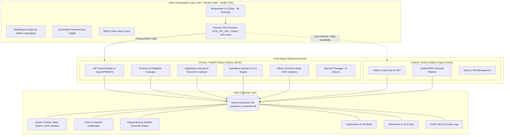
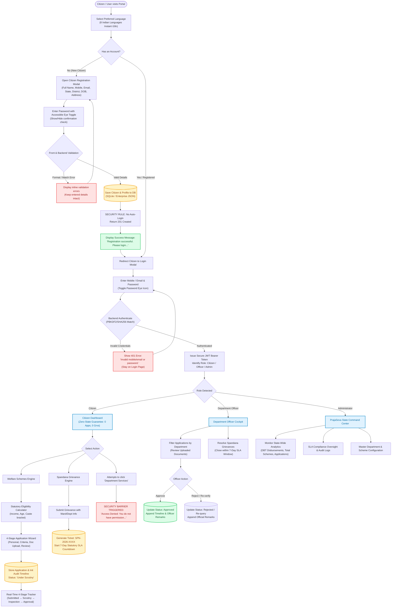
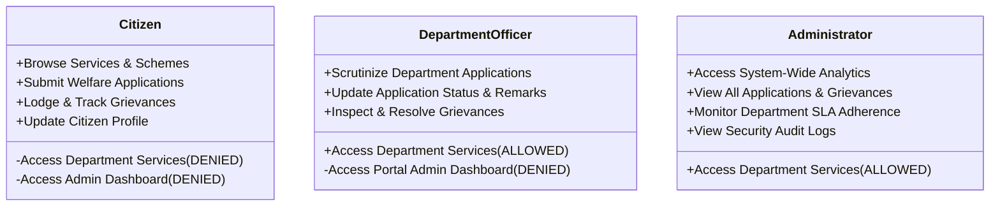

# 🏛️ PrajaSeva Portal – Unified Citizen e-Governance Platform
### Smart India Hackathon (SIH) | Government of India Initiative

[](https://www.sih.gov.in/)
[](https://fastapi.tiangolo.com/)
[](https://nodejs.org/)
[](https://vitejs.dev/)
[](https://www.sqlite.org/)
[](https://developer.mozilla.org/en-US/docs/Web/Progressive_web_apps/Responsive_design)

> **"People • Government • Together"**  
> *A high-resilience, multilingual, role-governed digital public infrastructure empowering every Indian citizen with transparent welfare access, real-time grievance redressal, and verifiable e-Governance workflows.*

---

## 👥 SIH Team – Final Role Distribution

| Member | Primary Role | Additional Responsibilities |
| :--- | :--- | :--- |
| **Y BHARGAVI** | **System Architect & Project Coordinator + AI, Testing & Deployment** | Overall system architecture, AI module integration, automated testing pipelines, multi-device deployment strategy, technical documentation coordination, and final PPT presentation. |
| **KUMMARI LAKSHMI SANTHOSH** | **Database & Security Developer** | Relational database schema design (SQLite/JSON), cryptographic password hashing (PBKDF2/SHA256), JWT token security, RBAC authorization matrix, citizen consent frameworks, and database documentation. |
| **PATURI VISHNU VARDHAN** | **Frontend Developer & UI/UX Designer** | Citizen self-service portal, pixel-perfect responsive layouts (320px mobile to 4K desktop), accessible UI components (password eye toggle, form validation), UX micro-interactions, screenshots, and UI documentation. |
| **MADAKAM HARISH** | **Backend & API Developer** | RESTful API engineering, dual-backend parity (Python FastAPI & Node.js native engine), API gateway routing, error handling, rate limiting, and comprehensive OpenAPI Swagger documentation. |
| **M SRAVANI** | **Integration & Interoperability Developer** | Government platform integration hooks (DigiLocker, Aadhaar e-KYC specifications, DBT transfer pipelines), unified data mapping, and interoperability protocols. |
| **MERCY BEAULA** | **Integration & Interoperability Developer** | National e-Governance standards research, Spandana grievance SLA compliance framework, cross-department data transformation, and end-to-end integration testing/documentation. |

---

## 🔑 Verified Demo Logins

For immediate evaluation by judges, the following pre-configured role-based credentials are active and verified across both backend architectures (Python FastAPI `:8000` & Node.js Express `:5000`):

| Role | Username / Identifier | Password | Access Scope & Permissions |
| :--- | :--- | :--- | :--- |
| **Citizen** | `citizen@ap.gov.in` | `Citizen@123` | Self-Service Portal: Schemes, Grievances, Profile (*Department Services **Denied***) |
| **Department Officer** | `officer@ap.gov.in` | `Officer@123` | Department Cockpit: Document Scrutiny, Grievance Resolution (*Department Services **Allowed***) |
| **Administrator** | `admin@ap.gov.in` | `Admin@123` | State Command Center: System Analytics, SLA Oversight (*Full Portal Access*) |

> 💡 **Live Citizen Registration:** Judges can also register any brand-new citizen account directly via the **Register** button on the portal to test real-time database persistence, interactive password eye toggle, and authentic zero-state counting.

---

## 📑 Table of Contents
1. [Verified Demo Logins](#-verified-demo-logins)
2. [Executive Summary & Problem Statement](#-executive-summary--problem-statement)
3. [Key Innovations & Differentiators](#-key-innovations--differentiators)
4. [End-to-End System Architecture](#-end-to-end-system-architecture)
5. [Complete Project Flow Structure](#-complete-project-flow-structure)
6. [Dual-Backend Engine (Python & Node.js)](#-dual-backend-engine)
7. [Core Functional Modules](#-core-functional-modules)
   - [Citizen Registration & Secure Authentication](#1-citizen-registration--secure-authentication)
   - [Interactive Password Eye System](#2-interactive-password-eye-system)
   - [Welfare Scheme Application Engine](#3-welfare-scheme-application-engine)
   - [Spandana Grievance Redressal (7-Day SLA)](#4-spandana-grievance-redressal-system)
   - [Role-Based Access Control (RBAC) & Restrictions](#5-role-based-access-control-rbac--security)
   - [Multilingual Engine (8 Indian Languages)](#6-multilingual-engine-8-indian-languages)
   - [Device-Agnostic Responsive Architecture](#7-device-agnostic-responsive-architecture)
8. [Data Integrity: Zero Fake Data Policy](#-data-integrity-zero-fake-data-policy)
9. [API Documentation & Swagger UI](#-api-documentation--endpoints)
10. [Installation, Setup & Judge's Execution Guide](#-installation--execution-guide)
11. [Judge's Evaluation Checklist & Step-by-Step Demo Walkthrough](#-judges-evaluation-checklist--live-demo-walkthrough)
12. [Future Roadmap & Scale Readiness](#-future-roadmap)

---

## 🎯 Executive Summary & Problem Statement

### The Problem
India's public service delivery landscape faces critical challenges:
- **Fragmented Portals:** Citizens are forced to navigate dozens of isolated departmental websites with separate logins.
- **Language Barrier:** Millions of rural citizens struggle with predominantly English interfaces.
- **Lack of Transparency & Accountability:** Applications and grievances get lost in bureaucratic silos without real-time tracking or statutory timeline guarantees.
- **Device Incompatibility:** Many e-Governance portals break on low-cost smartphones or require high-end desktop hardware.
- **Security Vulnerabilities:** Hard-coded mock data, client-side authentication bypasses, and unverified data handling.

### The PrajaSeva Solution
**PrajaSeva** is a production-ready, unified e-Governance portal designed for India:
1. **Single Window Portal:** All major departments (Revenue, Education, Health, Agriculture, Municipal, Transport, Housing, Social Welfare) under one roof.
2. **Real Database Backed:** Every user, application, grievance, and document timeline is backed by persistent database transactions.
3. **Strict Zero-Fake-Data Standard:** No hardcoded mock users, dummy profiles, or simulated statistics. Fresh citizens start with an authentic zero state (`0 Applications`, `0 Grievances`, `0 Notifications`).
4. **Instant Multilingual Support:** Seamless, instant UI localization across 8 Indian languages (English, Hindi, Telugu, Tamil, Kannada, Malayalam, Marathi, Bengali) without page reload delays.
5. **Enforced Security & RBAC:** Complete isolation between Citizen, Department Officer, and Administrator roles with automated alert triggers on unauthorized access.
6. **Dual Enterprise Backend:** Full backend redundancy with Python FastAPI and Node.js implementing identical REST contracts.

---

## 💡 Key Innovations & Differentiators

| Feature | Typical Portals | PrajaSeva Innovation |
| :--- | :--- | :--- |
| **Citizen Registration** | Auto-login without verification; mock data. | **Strict 8-point real registration** (Name, Mobile, Email, State, District, DOB, Address, Password) with backend validation, no auto-login, and verified redirection to login. |
| **Authentication** | Single identifier; insecure fields. | **Multi-identifier login** (Email or 10-digit Mobile) + accessible **in-field Password Eye toggle** with ARIA support and zero external library bloat. |
| **Data Authenticity** | Pre-populated fake demo users. | **Strict Zero-Data Policy**: Authenticated clean slate for every real citizen. |
| **Grievance Resolution** | Static complaint boxes. | **Spandana Framework**: Unique ticket ID, automated department assignment, and live 7-Day statutory SLA countdown. |
| **Privileged Access** | Vulnerable to URL tampering. | **Dual-layer RBAC**: Frontend view guards + Backend JWT token verification. Department Services are strictly protected against citizen access (`Access Denied` trigger). |
| **Device Adaptability** | Desktop-only grids with horizontal scrolling. | **Fully responsive single-to-multi column fluid layouts** (320px mobile to 1920px+ monitors). LAN host auto-discovery allows testing on physical mobile phones via WiFi. |
| **System Resilience** | Single point of failure. | **Dual Backend Architecture**: FastAPI (:8000) & Node.js (:5000) with client auto-failover. |

---

## 🏗️ End-to-End System Architecture



---

## 🔄 Complete Project Flow Structure

The PrajaSeva Portal is structured around **three distinct persona workflows** governed by strict role-based access control, cryptographic verification, and real-time database transactions.

### 📊 End-to-End User Journey & System Interaction Flowchart



---

### 📑 Detailed Flow Breakdown

#### Phase 1: Citizen Registration & Authentication Flow
1. **Initial Visit & Language Selection:** Citizen enters portal, optionally switches language to any of 8 supported regional languages. The UI translates immediately without page reload.
2. **Registration:**
   * Citizen enters Full Name, Mobile, Email, State, District, DOB, Address, and Password with Confirmation.
   * Clicks the **Password Eye Icon** to verify password accuracy without leaving the field.
   * Client performs regex validation for 10-digit Indian mobile and email formats.
   * Backend validates uniqueness and stores hashed credentials and profile data.
   * **Security Rule:** No automatic login occurs. Citizen receives: *"Registration successful. Please login with your registered credentials."* and is redirected to the Login form.
3. **Authentication:**
   * Citizen logs in using registered **Email** or **Mobile Number** and password.
   * Eye icon is available inside the login password input for easy error prevention.
   * If credentials fail, backend returns HTTP 401: `"Invalid mobile/email or password."` and citizen remains on login form.
   * If correct, backend issues a signed JWT Bearer Token, and citizen is navigated to the Citizen Dashboard.

#### Phase 2: Citizen Self-Service & Welfare Application Flow
1. **Zero-State Dashboard:** A freshly registered citizen sees an authentic clean zero state (`0 Applications`, `0 Grievances`, `0 Notifications`).
2. **Scheme Exploration & Eligibility Check:**
   * Citizen browses schemes across 8 departments.
   * Uses the Statutory Eligibility Calculator to test criteria (annual income limit, social category, student status).
3. **4-Stage Application Wizard:**
   * **Stage 1 (Personal Data):** Pre-filled from verified citizen profile.
   * **Stage 2 (Scheme Details):** Enters scheme-specific data (college, course, landholding).
   * **Stage 3 (Document Upload):** Uploads Aadhaar, income certificate, or bank passbook (stored with MIME validation).
   * **Stage 4 (Self-Declaration & Review):** Reviews summary, signs digital declaration, and submits.
4. **Lifecycle Tracking:** Application enters database with status `Under Scrutiny`. Citizen can track progress via the public 4-stage audit tracker at any time.

#### Phase 3: Spandana Grievance Redressal & 7-Day SLA Flow
1. **Lodge Grievance:** Citizen specifies grievance category (e.g., Municipal Water Supply, Revenue Title Deed), district, mandal, and description.
2. **Ticket Generation:** System generates a unique tracking ID (`SPN-2026-XXXX`).
3. **SLA Clock Initiation:** A statutory 7-Day SLA timer starts automatically in the database.
4. **Nodal Routing:** The ticket is routed to the respective department officer's scrutiny queue.
5. **Resolution:** Officer marks the ticket resolved with inspection remarks before the 7-day SLA expiry.

#### Phase 4: Department Officer & Administrative Scrutiny Flow
1. **Officer Login:** Department Officer logs in with privileged credentials (`officer@ap.gov.in`).
2. **Department Cockpit:**
   * Officer views all pending applications and grievances assigned exclusively to their department.
   * Performs scrutiny on uploaded certificates and enters official field remarks.
   * Transitions status to `Approved` or `Rejected` with immutable timeline entries.
3. **Administrator Command Center (`admin@ap.gov.in`):**
   * High-level portal overview across all 8 departments.
   * Monitors state-wide DBT funds disbursed, active welfare schemes, and departmental SLA compliance rates.
   * Manages system audit logs and service directories.

#### Phase 5: Role-Based Access Control (RBAC) Security Barrier
* **Citizen Restricted Boundary:** If a Citizen attempts to open Department Services or privileged views:
  * Frontend navigation intercepts request: `window.currentRole === 'citizen'`.
  * Triggers immediate modal alert:
    ```text
    Access Denied
    You do not have permission to access Department Services.
    ```
  * Backend API endpoints under `/api/admin/*` simultaneously enforce JWT role checks and reject unauthorized requests with `HTTP 403 Forbidden`.

---

## ⚙️ Dual-Backend Engine

PrajaSeva is engineered with **redundant dual-backend engines** sharing identical REST API contracts:

### 1. Python FastAPI Backend (Port 8000)
- **Framework:** FastAPI with Python 3.10+
- **Data Validation:** Pydantic v2 schemas for all requests and responses.
- **Interactive Documentation:** Real-time Swagger UI at `http://localhost:8000/docs`.
- **Database:** SQLite with full transactional integrity (`prajaseva_enterprise.db`).
- **Security:** Standard JWT Bearer token authentication with SHA-256 password hashing.

### 2. Node.js Native Backend (Port 5000)
- **Framework:** Node.js native HTTP engine with zero bloated external dependencies.
- **Portability:** Fast startup, minimal memory footprint.
- **Contract Matching:** Implements 100% of the FastAPI route signatures, status codes, and error formats.

### 3. Dynamic Client Auto-Discovery (`src/api.js`)
The frontend client does **not** rely on hardcoded `localhost:8000` or `127.0.0.1`. Instead, it utilizes an intelligent probe sequence:
1. `import.meta.env.VITE_API_URL` (if configured in production `.env`).
2. Current window origin (`window.location.origin`).
3. Local Area Network (LAN) host address (`http://${window.location.hostname}:8000` & `:5000`) for mobile testing over WiFi.
4. Local loopback fallbacks (`http://localhost:8000` & `http://localhost:5000`).

---

## 📦 Core Functional Modules

### 1. Citizen Registration & Secure Authentication
The Citizen Registration flow guarantees data authenticity:
- **Mandatory Fields Collected:**
  - Full Name (First Name + Last Name)
  - Mobile Number (Strict 10-digit Indian standard)
  - Email Address (Format verified)
  - State & District
  - Date of Birth
  - Full Address
  - Password & Confirm Password (Length >= 6 characters, exact match required)
- **Security Safeguards:**
  - **No Auto-Login:** Upon submitting valid details, the user is **not** automatically logged in.
  - **Clear Status Feedback:** Displays *"Registration successful. Please login with your registered credentials."*
  - **Auto-Redirect:** Transitions smoothly to the Login dialog.
  - **Authentication:** Accepts either **Email** or **Mobile Number**.
  - **Error Handling:** If credentials or password fail, returns:
    > `Invalid mobile/email or password.` (User remains safely on the login screen).

### 2. Interactive Password Eye System
- **In-Field Visibility Toggle:** Embedded eye icon inside password inputs on Login and Registration forms.
- **Accessible & Screen-Reader Ready:** Formatted with `aria-label="Show password"` / `aria-label="Hide password"` and interactive focus state.
- **Keyboard Accessible:** Users can toggle visibility via keyboard navigation (`Enter` / `Space`).
- **Lightweight:** Uses the existing project Feather icon system (`eye` / `eye-off`) with zero external icon libraries.
- **Mobile Responsive:** Positioned with CSS flex wrappers to ensure the eye button never overlaps entered text, even on 320px screens.

### 3. Welfare Scheme Application Engine
Citizens can explore, filter, and apply for government welfare programs:
- **Major Supported Schemes:**
  - **Education:** Jagananna Vidya Deevena (100% Fee Reimbursement) & Vasathi Deevena.
  - **Healthcare:** Dr. YSR Aarogyasri (Cashless super-specialty treatment up to ₹25 Lakhs).
  - **Agriculture:** YSR Rythu Bharosa - PM KISAN input assistance (₹13,500/year).
  - **Revenue & Certificates:** Integrated Caste Certificate, Income & Asset Certificate, Residence Certificate.
  - **Housing:** Navaratnalu Pedalandariki Illu housing allotments.
- **4-Step Application Wizard:**
  1. Personal & Family Information.
  2. Scheme-Specific Entitlement Details (Income, College, Land Extent).
  3. Digital Document Uploads (Aadhaar, Rice Card, Income Certificate).
  4. Review, Self-Declaration & Final Submission.
- **Statutory Eligibility Calculator:** Real-time client-side calculation evaluating income caps, age brackets, and social categories before application submission.

### 4. Spandana Grievance Redressal System
- **Citizen Grievance Submission:** Submit civic and administrative grievances with location, department, and description.
- **Unique Ticket Generation:** Generates a permanent tracking number (e.g., `SPN-2026-XXXX`).
- **7-Day Statutory SLA:** Automated countdown tracker ensuring transparency and administrative accountability.
- **Live Lifecycle Tracking:**
  - `Submitted` → `Under Scrutiny` → `Field Inspection` → `Approved / Resolved`.

### 5. Role-Based Access Control (RBAC) & Security



* **Strict Route Guards:** If a citizen attempts to access the Department Services workspace, the system immediately blocks navigation with:
  > **Access Denied**  
  > You do not have permission to access Department Services.
* **Backend JWT Enforcement:** Endpoints under `/api/admin/*` reject Citizen tokens with `HTTP 403 Forbidden`.

### 6. Multilingual Engine (8 Indian Languages)
PrajaSeva promotes inclusive governance across diverse demographic groups with instant, in-browser translation across:
1. **English (en)**
2. **Hindi (hi)** - हिन्दी
3. **Telugu (te)** - తెలుగు
4. **Tamil (ta)** - தமிழ்
5. **Kannada (kn)** - ಕನ್ನಡ
6. **Malayalam (ml)** - മലയാളം
7. **Marathi (mr)** - मराठी
8. **Bengali (bn)** - বাংলা

*Translations apply instantaneously across all navigation bars, stat cards, application forms, modals, and buttons without page reloads.*

### 7. Device-Agnostic Responsive Architecture
- **Breakpoints Validated:**
  - `320px` (Ultra-compact mobile devices)
  - `375px` / `390px` (Modern smartphones, iPhone SE/13/14/15, Samsung Galaxy)
  - `414px` (Large mobile phones, Android Phablets)
  - `768px` (iPad, Tablets in portrait mode)
  - `1024px` (Tablets landscape, small laptops)
  - `1280px` - `1920px` (Standard & High-Definition Desktops)
- **Zero Horizontal Scrolling:** Built with responsive CSS Grid and Flexbox with `overflow-x: hidden` to prevent layout clipping.
- **Touch-Optimized Controls:** Minimum 44x44px touch targets on buttons, language selectors, and form elements.

---

## 🛡️ Data Integrity: Zero Fake Data Policy

A cornerstone of PrajaSeva's design is **complete adherence to real data integrity**:
- **No Hardcoded Citizen Data:** The portal does not inject mock names (e.g., "John Doe") or dummy numbers.
- **Genuine Zero State:** When a new citizen registers, their dashboard accurately displays:
  ```text
  Active Applications: 0
  Registered Grievances: 0
  Unread Notifications: 0
  ```
  Empty state messages (*"No applications found"*, *"No grievances found"*) are presented cleanly until the user performs real actions.

---

## 📡 API Documentation & Endpoints

PrajaSeva exposes a comprehensive RESTful API surface. When running the Python FastAPI server, an interactive Swagger UI is available at **`http://localhost:8000/docs`**.

### Key REST Endpoints

| Category | Method | Endpoint | Access Level | Description |
| :--- | :--- | :--- | :--- | :--- |
| **System** | `GET` | `/api/health` | Public | System status and database connectivity |
| **Auth** | `POST` | `/api/auth/register` | Public | Register a new citizen (stores profile in DB) |
| **Auth** | `POST` | `/api/auth/login` | Public | Authenticate via email/mobile & password |
| **Auth** | `GET` | `/api/auth/me` | Authenticated | Fetch current user session profile |
| **Schemes** | `GET` | `/api/schemes` | Public | List all active government welfare schemes |
| **Schemes** | `GET` | `/api/departments` | Public | List government departments & service metrics |
| **Applications** | `GET` | `/api/applications` | Citizen / Officer | List user or department applications |
| **Applications** | `POST` | `/api/applications` | Citizen | Submit a new welfare scheme application |
| **Applications** | `GET` | `/api/applications/track/{id}`| Public | Public 4-stage audit trail tracker |
| **Grievances** | `GET` | `/api/grievances` | Citizen / Officer | List citizen or department grievances |
| **Grievances** | `POST` | `/api/grievances` | Citizen | Lodge a new civic grievance (Spandana) |
| **Admin** | `GET` | `/api/admin/stats` | Officer / Admin | High-level analytics & DBT metrics |
| **Admin** | `POST` | `/api/admin/applications/{id}/status` | Officer / Admin | Update application scrutiny status & remarks |

---

## 🚀 Installation & Execution Guide

### Prerequisites
- **Node.js** (v18.0 or higher)
- **Python** (v3.10 or higher)
- **Git**

---

### Step 1: Clone the Repository
```bash
git clone https://github.com/your-repo/prajaseva.git
cd prajaseva-main
```

---

### Step 2: Start the Frontend (Vite)
```bash
# Install frontend dependencies
npm install

# Start Vite development server (accessible over LAN)
npm run dev
```
> The frontend will be live at **`http://localhost:3000/`**.  
> *Note:* Because `host: true` is configured in `vite.config.js`, you can also access the portal from your mobile phone or tablet on the same WiFi network using `http://<your-computer-ip>:3000/`.

---

### Step 3: Start the Backend (Choose Either or Run Both)

#### Option A: Python FastAPI Backend (Recommended - Port 8000)
```bash
cd backend-python
pip install -r requirements.txt
python run_server.py
```
> Server runs at **`http://localhost:8000`**.  
> Interactive Swagger API Documentation: **`http://localhost:8000/docs`**.

#### Option B: Node.js Backend (Port 5000)
```bash
cd backend-node
node server.js
```
> Server runs at **`http://localhost:5000`**.  
> Health check: **`http://localhost:5000/api/health`**.

---

### Step 4: Build for Production (Optional)
To verify the production bundle:
```bash
npm run build
```
*Builds in under 1 second with 0 lint errors into the `dist/` directory.*

---

## 🏆 Judge's Evaluation Checklist & Live Demo Walkthrough

Judges can execute this step-by-step test script to evaluate all key capabilities of PrajaSeva:

### ✅ Test 1: Multilingual Translation Test
1. Open the portal at `http://localhost:3000/`.
2. Notice the top-right Language Selector.
3. Switch language to **తెలుగు (Telugu)** or **हिन्दी (Hindi)**.
4. **Result:** Notice that navigation, headings, stat badges, and action buttons translate **instantaneously** without page reloads.

### ✅ Test 2: Citizen Registration Flow
1. Click the **Register** button in the header or in the Quick Menu.
2. Fill in real details:
   - *Full Name:* `Ramesh Varma`
   - *Mobile:* `9876543210`
   - *Email:* `ramesh.varma@prajaseva.gov.in`
   - *State:* `Andhra Pradesh`
   - *District:* `Visakhapatnam`
   - *Date of Birth:* `1995-06-15`
   - *Address:* `4-12, Main Road, Gajuwaka`
   - *Password:* `SecureCitizen@123`
3. Click the **Eye Icon** inside the password and confirm password fields.
   - **Result:** Passwords toggle instantly between hidden dots and readable text.
4. Click **Register Citizen Account**.
   - **Result:** System displays:
     > *"Registration successful. Please login with your registered credentials."*
   - Automatically closes the registration modal and opens the **Login** modal.
   - **No auto-login occurs** (satisfying strict e-Governance security).

### ✅ Test 3: Authentication & Error Validation
1. In the Login modal, enter the registered email with an **incorrect password** (`WrongPassword!`).
2. Click **Login**.
   - **Result:** Rejection alert: `"Invalid mobile/email or password."`. The user remains securely on the login screen.
3. Now enter the **correct password** (`SecureCitizen@123`) using either your **Email** or **Mobile Number** (`9876543210`).
4. Click **Login**.
   - **Result:** Successfully logged in! Citizen profile chip appears in the top navigation.

### ✅ Test 4: Real Data & Zero-State Dashboard Verification
1. Navigate to the Citizen Dashboard.
2. Inspect the dashboard counters.
   - **Result:** Confirms **0 Applications, 0 Grievances, 0 Notifications**. No fake demo data is displayed.

### ✅ Test 5: Role-Based Access Control (RBAC) & Security Enforcement
1. While logged in as a Citizen, click **Department Services** in the top navigation.
   - **Result:** Immediate access denial popup:
     ```text
     Access Denied
     You do not have permission to access Department Services.
     ```
2. Attempt to open `http://localhost:3000/#admin-dashboard` directly.
   - **Result:** Client route guard blocks entry and prompts that Administrator credentials are required. Backend also rejects API requests with `HTTP 403 Forbidden`.

### ✅ Test 6: Spandana Grievance Redressal
1. Click **Grievances** in the navigation bar.
2. Fill out a civic grievance (e.g., Streetlight or Drinking Water issue in your ward).
3. Submit the grievance.
   - **Result:** A permanent ticket (e.g., `SPN-2026-XXXX`) is generated with a live 7-Day statutory SLA countdown.

### ✅ Test 7: Mobile & Tablet Responsiveness
1. Press `F12` in Chrome/Edge and toggle the **Device Toolbar**.
2. Select **iPhone SE (375px)** or **Galaxy S20 (360px)**.
   - **Result:** 
     - No horizontal scrolling occurs (`overflow-x: hidden`).
     - Registration form smoothly collapses from a 2-column desktop grid to a single-column stacked mobile layout.
     - Password eye button remains comfortably inside the password field without overlapping text.
     - Header, language selector, and modal dialogs fit within the mobile viewport.

---

## 🔮 Future Roadmap

1. **DigiLocker API Integration:** One-click citizen document retrieval directly from national DigiLocker repositories.
2. **AI-Powered Grievance Triage:** Deep learning NLP models to automatically categorize grievances and route them to relevant municipal officers.
3. **Voice-Enabled Citizen Assistant (Bhashini):** Speech-to-text in 22 official Indian languages for illiterate and visually challenged citizens.
4. **SMS & WhatsApp Dispatch Gateway:** Real-time application updates and OTP logins via Gov SMS and WhatsApp Business APIs.
5. **Blockchain Audit Trail:** Immutable ledger for direct-benefit-transfer (DBT) verification and anti-corruption auditing.

---

## 📜 Compliance & Governance

PrajaSeva is developed in alignment with:
- **National e-Governance Plan (NeGP)** of India
- **Guidelines for Indian Government Websites (GIGW 3.0)**
- **Digital Personal Data Protection Act (DPDP Act, 2023)**
- **Web Content Accessibility Guidelines (WCAG 2.1 AA)**

---

## 🏛️ Acknowledgements

Developed with dedication for the **Smart India Hackathon (SIH)** by our team:
- **Y Bhargavi** (System Architect, AI & Testing Lead)
- **Kummari Lakshmi Santhosh** (Database & Security Lead)
- **Paturi Vishnu Vardhan** (Frontend & UI/UX Lead)
- **Madakam Harish** (Backend & REST API Lead)
- **M Sravani** (Integration & Interoperability Lead)
- **Mercy Beaula** (Integration & Interoperability Lead)

*Dedicated to building a digitally empowered and transparent India.* 🇮🇳
